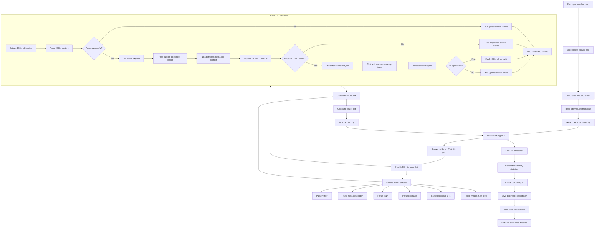

# CheckSEO Offline Flow

## Tổng quan

Script `checkseo-offline.js` thực hiện SEO analysis offline cho toàn bộ project Oscar Family. Nó build project, parse HTML files, validate SEO metadata và JSON-LD structured data.

## Flow Diagram



## Chi tiết các bước

### 1. Initialization
- **Build project**: Chạy `vite-ssg build` để tạo HTML files
- **Check dist/**: Verify build output exists
- **Read sitemap**: Parse `sitemap.xml` để lấy list URLs

### 2. URL Processing Loop
For each URL in sitemap:
- **Convert URL to file path**: `https://domain.com/path` → `dist/path.html`
- **Read HTML file**: Load prerendered HTML content

### 3. SEO Metadata Extraction
Parse HTML using regex:
- `<title>` - Page title
- `<meta name="description">` - Meta description
- `<h1>` - Main heading
- `<meta property="og:image">` - Open Graph image
- `<link rel="canonical">` - Canonical URL
- `` tags - Check alt attributes

### 4. JSON-LD Validation (Subgraph Detail)
- **Extract scripts**: Find all `<script type="application/ld+json">` tags
- **Parse JSON**: Validate JSON syntax for each script
- **Custom document loader**: Use offline `dev/schemaorg-context.jsonld` instead of fetching from web
- **jsonld.expand**: Convert compact JSON-LD to expanded RDF triples
- **Type validation**: Check if `@type` values are valid schema.org types
- **Unknown types detection**: Flag non-schema.org types as errors
- **Issue collection**: Aggregate all validation errors and warnings

### 5. Scoring System
- **Base score**: 100 points
- **Error penalty**: -10 points each
- **Warning penalty**: -5 points each
- **Minimum score**: 0

### 6. Report Generation
- **Summary stats**: Average score, perfect pages, issue counts
- **Per-page results**: Metadata, JSON-LD status, issues
- **Save to JSON**: `dev/seo-report.json`

## Dependencies

- **fs/promises**: File system operations
- **path**: Path manipulation
- **jsonld**: JSON-LD validation library
- **Custom document loader**: Offline schema.org context from `dev/schemaorg-context.jsonld`

## Key Technical Details

### Custom Document Loader
```javascript
// Load offline schema.org context instead of fetching from web
async function customDocumentLoader(url) {
  if (url.includes('schema.org')) {
    // Load from dev/schemaorg-context.jsonld
    return { document: localSchemaContext };
  }
  // Use default loader for other URLs
}
```

### Type Validation Logic
- **Known prefix**: `http://schema.org/`
- **Check expansion**: Invalid types fail to expand properly
- **Error reporting**: Flag unknown types with context path

### Offline Context File
- **`dev/schemaorg-context.jsonld`**: Cached schema.org vocabulary
- **No internet required**: Complete offline validation
- **Updated separately**: Manual sync with schema.org

## Usage

```bash
# Run complete SEO analysis
npm run checkseo

# View results in browser
npm run fe
# Navigate to: http://localhost:5173/checkseo
```

## Output Files

- **`dev/seo-report.json`**: Detailed analysis report
- **`dist/`**: Build output (HTML files for analysis)

## Error Handling

- **Missing dist/**: Exit with error
- **Empty sitemap**: Exit with error
- **Parse failures**: Log as issues, continue processing
- **Critical errors**: Exit with error code 1
